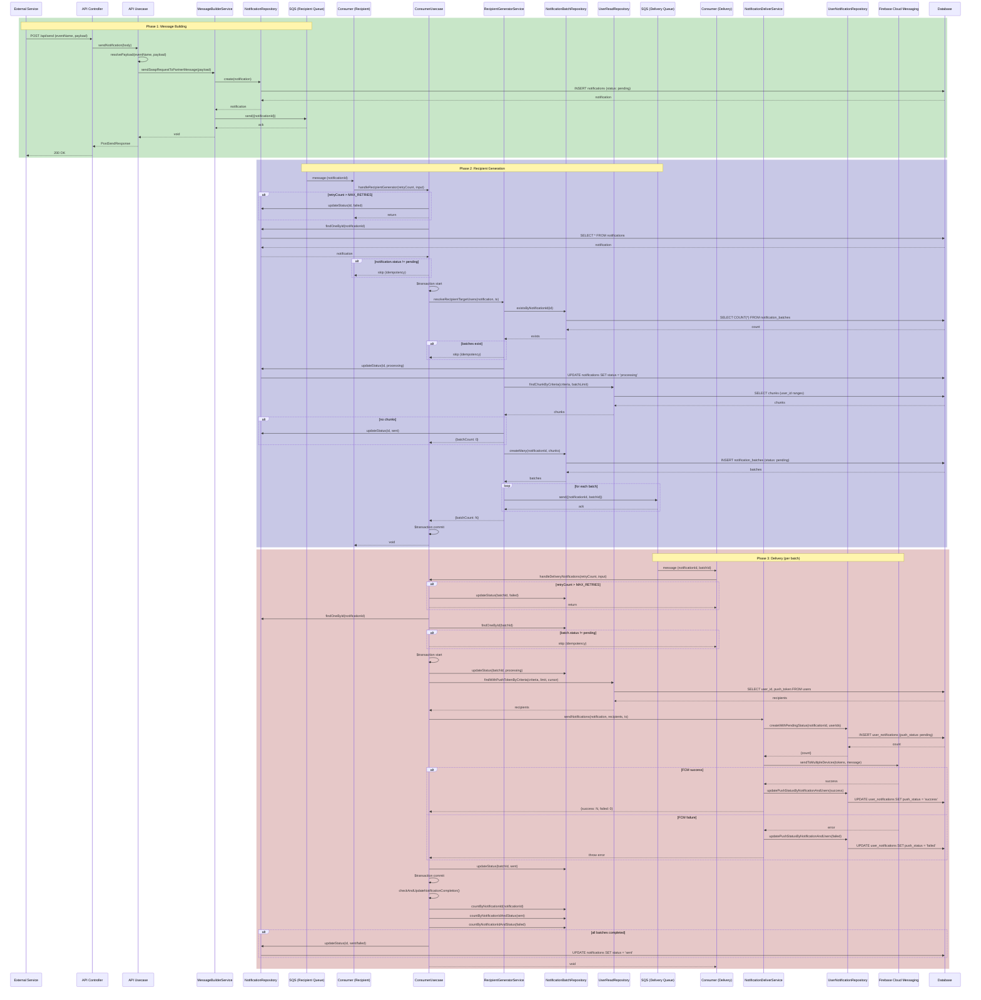

# Notification Service Flow

## Sequence Diagram



## Status Transitions

### Notification Status Flow
```
pending → processing → sent
                    ↘ failed
```

### Notification Batch Status Flow
```
pending → processing → sent
                    ↘ failed
```

### User Notification Push Status Flow
```
pending → success
       ↘ failed
```

## Key Features

### 1. Idempotency
- **Recipient Generator**: Checks if notification status is `pending` before processing
- **Recipient Generator**: Checks if batches already exist before creating
- **Delivery**: Checks if batch status is `pending` before processing

### 2. Error Handling
- Max retry limits with status updates on failure
- Transaction rollback on errors
- FCM failures are caught and recorded

### 3. Batch Completion Tracking
- After each batch delivery, checks if all batches are complete
- Updates notification status to `sent` only when all batches succeed
- Updates notification status to `failed` if any batch fails

### 4. Proper Status Flow
- `push_status: pending` on insert to `user_notifications`
- `push_status: success/failed` after FCM call
- Notification transitions: `pending → processing → sent/failed`

## Database Tables

| Table | Purpose |
|-------|---------|
| `notifications` | Main notification record with target info |
| `notification_batches` | Batch records for chunked processing |
| `user_notifications` | Per-user delivery records (inbox) |
| `user_devices` | User push tokens |
| `users` | User information |

## Message Queues

| Queue | Purpose |
|-------|---------|
| `SQS_QUEUE_RECIPIENT_NAME` | Recipient generation jobs |
| `SQS_QUEUE_DELIVERY_NAME` | Batch delivery jobs |
